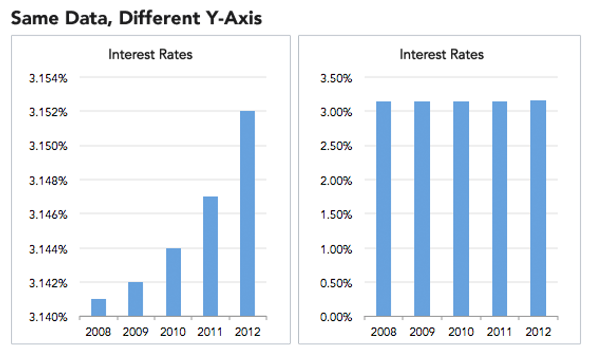
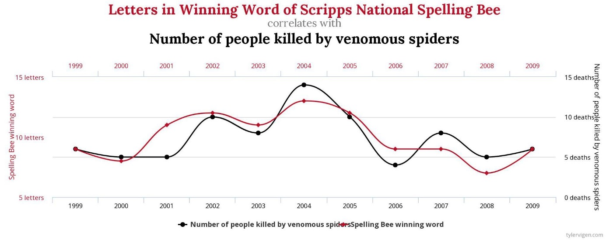

# ⚖️ Ethics in Data Visualization

“**Ethical thinking is about not only intentions, but consequences.**”  
— *Alberto Cairo*

This page explores how data visualizations can be misleading—intentionally or unintentionally—and outlines techniques and examples based on our workshop materials.

---

## 🚩 What Makes a Visualization Deceptive?

> *“A graphical depiction of information, designed with or without an intent to deceive, that may create a belief about the message... which varies from the actual meaning.”*  
> — From *How Deceptive are Deceptive Visualizations?*

Types of issues include:
- Misleading visualizations
- Misinterpreted visualizations
- Ignoring design conventions
- Poor data communication practices

---

## 🛠️ Techniques That Can Mislead

### 1. Truncated Y-Axis

Truncating the Y-axis exaggerates small differences and can lead viewers to interpret the data as more dramatic than it is.

---

### 2. Dual Axis / Line Graphs

Using two y-axes can falsely imply correlation between unrelated variables if not clearly labeled or explained.

---

### 3. Cumulative Graphs vs Annual Trends

These two graphs show the same data in different ways:

#### Cumulative Revenue

This can falsely suggest consistent growth, even when annual revenues are declining.

#### Annual Revenue

Annual view reveals a steady decline after 2005.

---

### 4. Ignoring Conventions

Reversing axes or inverting visuals without clear reason can distort interpretation.

#### Example:

Original graph:

How it should look:

The first chart is flipped vertically, misleading viewers about whether the trend is increasing or decreasing.

---

## 🧠 Example of Misleading Framing

This chart uses angled labels and dramatic colors to visually emphasize a controversial message, but fails to provide full data context.

---

## 📊 Spurious Correlations

Just because two lines look similar doesn’t mean there's a meaningful relationship. This chart shows a perfect example of **correlation without causation**.

---

## ✅ Tips for Ethical Visualization (Alberto Cairo)

From [Storybench Interview](https://www.storybench.org/six-ways-alberto-cairo-thinks-you-can-improve-your-data-visualizations/):

1. Don’t just look at charts—**read them**
2. Always **cite your data source**
3. Be cautious not to **over-interpret**
4. Use appropriate **scales and ranges**
5. Acknowledge **uncertainty**
6. Update ethical standards as tools and times change

---

## 📝 Five-Minute Critique

Practice looking at charts and asking:
- What story is being told?
- Is anything left out?
- Are any design choices exaggerating or hiding patterns?

---

**Download the full slides:**  
[📄 Lesson 2 – Ethics and Data Visualization (PDF)](Lesson%202_%20Ethics%20and%20Data%20Visualization.pdf)

---
